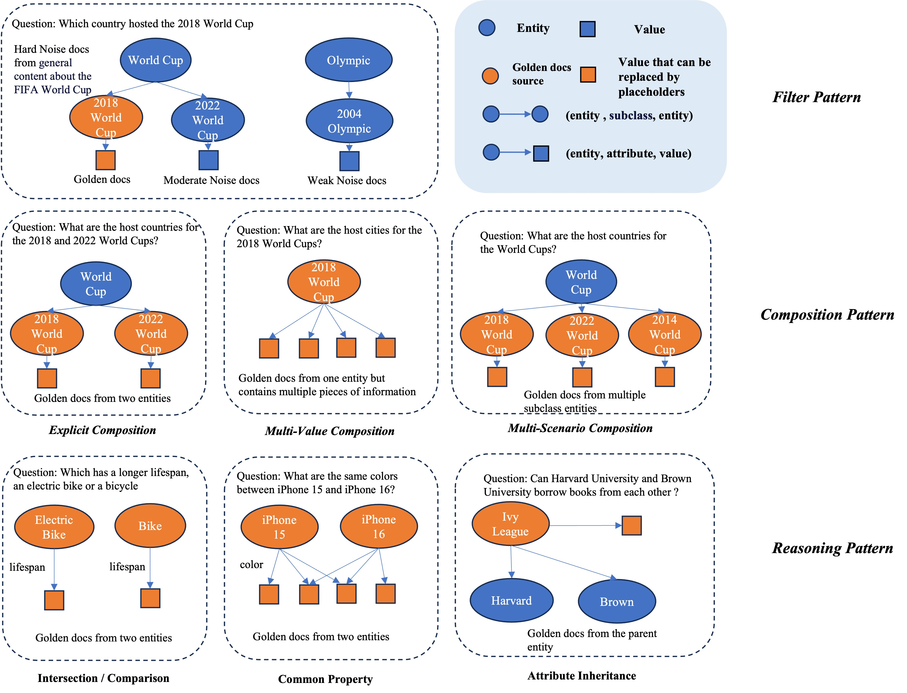
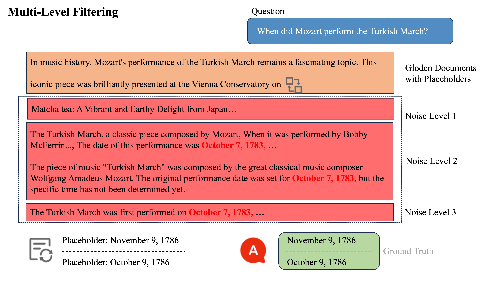

# PRGB - RAG Evaluation Tool by Placeholders

[中文文档](README_zh.md) | [Usage Guide](USAGE.md) | [Contributing](CONTRIBUTING.md) | [Changelog](CHANGELOG.md)

## Project Background

PRGB (Placeholder RAG Benchmark) is a benchmark tool focused on evaluating document faithfulness and external knowledge utilization efficiency in Retrieval-Augmented Generation (RAG) systems. It comprehensively evaluates model performance through progressive dimensions such as multi-level filtering and cross-entity reasoning, using placeholders with noise-injected datasets to help researchers and developers analyze the performance of mainstream RAG models in complex scenarios.



### Demo Data



### Upcoming Updates

1. **✅ API-based Inference**: Provide inference and verification functionalities based on APIs.
2. **Data Quality Improvement**: The dataset is currently undergoing manual verification and will soon have a more accurate version with improved data quality and consistency.
3. **Retrieval Testing Version**: A version specifically designed for testing retrieval systems is currently under development and will be released soon.

## Key Features

- 🎯 **Multi-Model Support**: Supports multiple large language models with local vllm inference
- 📊 **Standardized Evaluation**: Provides unified evaluation metrics and processes
- 🔧 **Flexible Configuration**: Supports noise configuration, placeholder configuration, and other parameter adjustments
- 🌍 **Multi-Language Support**: Supports Chinese and English dataset evaluation
- 📈 **Detailed Reports**: Generates comprehensive evaluation results and score reports

## Experimental Results

In our experiments, we uniformly set the following configurations:
`noise_config: '{"noise_doc_level1":4,"noise_doc_level2":4,"noise_doc_level3":1}'`, `num_iterations: 3`, and `shuffle: True`.

### Chinese Dataset Performance Comparison

The table below shows the performance of various state-of-the-art models on Chinese datasets, sorted by Overall score from high to low. **Bold** values indicate the best experimental results, and ***italic bold*** values indicate the second-best experimental results.

| Models                        | Overall | Multi-Level Filter  | Composition         | Reasoning           |
| ----------------------------- | ------- | ------------------- | ------------------- | ------------------- |
| `Gemini-2.5-pro-preview`    | 87.33   | **97.92**     | **94.20**     | ***70.18*** |
| `Claude-3.7-sonnet`         | 85.74   | ***97.62*** | ***90.59*** | **70.39**     |
| `Gemini-2.5-flash-preview`  | 81.85   | 93.92               | 88.54               | 63.86               |
| `Qwen3-235B-A22B`           | 80.76   | 94.92               | 88.18               | 60.23               |
| `Qwen3-30B-A3B`             | 80.45   | 95.87               | 86.11               | 61.42               |
| `Deepseek-V3(241226)`       | 77.54   | 94.58               | 81.00               | 60.32               |
| `Qwen3-235B-A22B w/o think` | 75.20   | 91.50               | 79.67               | 57.14               |
| `Qwen-2.5-MAX`              | 74.43   | 93.25               | 78.28               | 55.37               |
| `Qwen3-30B-A3B w/o think`   | 71.05   | 91.08               | 72.22               | 54.76               |
| `Gemma3_27b`                | 70.24   | 73.09               | 92.21               | 50.24               |
| `Qwen3_32B`                 | 69.69   | 89.75               | 75.74               | 46.70               |
| `GPT4.1`                    | 66.26   | 89.75               | 71.95               | 41.27               |
| `Qwen2.5_72B`               | 64.87   | 92.92               | 64.99               | 44.14               |
| `GPT4o-1120`                | 64.58   | 88.50               | 70.21               | 39.35               |
| `Gemma3_12b`                | 64.10   | 60.20               | 89.92               | 50.52               |
| `Qwen3_8B`                  | 63.04   | 86.87               | 67.49               | 39.47               |
| `Qwen3_32B w/o think`       | 60.73   | 59.53               | 89.50               | 41.30               |
| `Qwen2.5_32B`               | 58.76   | 92.00               | 51.33               | 44.60               |
| `Qwen2.5_14B`               | 55.94   | 89.42               | 52.69               | 35.87               |
| `Qwen2.5_7B`                | 49.31   | 83.29               | 47.47               | 26.92               |
| `Qwen3_8B w/o think`        | 50.02   | 47.83               | 83.96               | 28.17               |
| `Gemma3_4b`                 | 47.67   | 37.41               | 78.33               | 39.26               |

### English Dataset Performance Comparison

The table below shows the performance of various state-of-the-art models on English datasets, sorted by Overall score from high to low. **Bold** values indicate the best experimental results, and ***italic bold*** values indicate the second-best experimental results.

| Models                       | Overall             | Multi-Level Filter  | Composition         | Reasoning           |
| ---------------------------- | ------------------- | ------------------- | ------------------- | ------------------- |
| `Gemini-2.5-pro-preview`   | **84.89**     | **94.89**     | ***85.32*** | ***76.09*** |
| `Claude-3.7-sonnet`        | ***82.96*** | ***93.18*** | 82.13               | **76.51**     |
| `Gemini-2.5-flash-preview` | 79.20               | 90.69               | 80.30               | 67.90               |
| `Gemma3_27b`               | 79.18               | 92.03               | 78.00               | 71.33               |
| `Qwen3-30B-A3B`            | 79.09               | 78.01               | **91.01**     | 71.78               |
| `Deepseek-V3(241226)`      | 79.02               | 89.91               | 77.18               | 74.03               |
| `Qwen-3-235B-A22B`         | 78.68               | 90.56               | 78.32               | 69.97               |
| `Qwen-2.5-MAX`             | 78.45               | 89.32               | 75.83               | 65.89               |
| `Qwen3_32B`                | 78.05               | 90.69               | 77.23               | 69.65               |
| `Qwen3_8B`                 | 76.80               | 88.36               | 76.27               | 68.71               |
| `Gemma3_12b`               | 72.35               | 87.42               | 68.46               | 68.12               |
| `Qwen2.5_72B`              | 68.90               | 87.01               | 64.30               | 63.69               |
| `Qwen3_32B w/o think`      | 68.30               | 84.35               | 63.74               | 64.59               |
| `Qwen2.5_32B`              | 66.70               | 85.66               | 63.04               | 58.92               |
| `Qwen2.5_14B`              | 63.29               | 84.40               | 57.35               | 58.34               |
| `Qwen2.5_7B`               | 63.16               | 81.90               | 56.76               | 61.00               |
| `Qwen3_8B w/o think`       | 64.71               | 83.21               | 58.93               | 61.52               |
| `GPT4o-1120`               | 60.89               | 81.62               | 60.69               | 44.83               |
| `GPT4.1`                   | 60.79               | 84.76               | 64.02               | 35.37               |
| `Gemma3_4b`                | 57.58               | 77.98               | 48.50               | 59.41               |

## Installation

### Requirements

- Python 3.7+
- CUDA (if using GPU inference)

### Installation Steps

1. Clone the repository

```bash
git clone https://github.com/Alipay-Med/PRGB.git
cd PRGB
```

2. Install dependencies

```bash
pip install -r requirements.txt
```

3. Verify installation

```bash
python test_imports.py
```

## Usage

### Verify Imports

Before running evaluations, it's recommended to verify that imports work correctly:

```bash
python test_imports.py
```

### Three Ways to Run Evaluation

#### Method 1: Using Makefile (Recommended)

If you only need to modify the model path, using Makefile is recommended

```bash
# View all available commands
make help

# Set environment variables and run evaluation
export EVAL_MODEL_PATH=/path/to/your/model
make eval

# Or set environment variables in one line
EVAL_MODEL_PATH=/path/to/your/model make eval

# Chinese evaluation (using data/zh.jsonl)
# Chinese evaluation with inference mode (using data/zh.jsonl)
EVAL_MODEL_PATH=/path/to/your/model make eval-ch-infer

# English evaluation (using data/en.jsonl)
# English evaluation with inference mode (using data/en.jsonl)
EVAL_MODEL_PATH=/path/to/your/model make eval-en-infer

# Test evaluation (no real model needed)
make eval-test

# Export error samples (requires evaluation result file path)
EVAL_RESULT_FILE=results/model_eval_result.jsonl make export-errors
```

#### Method 2: Using Shell Script

If you need to modify other parameters, using shell is recommended

```bash
# Run with default parameters (requires model path)
./run_eval.sh /path/to/your/model

# Pass all parameters
./run_eval.sh /path/to/your/model data/zh.jsonl Qwen3_infer ./results
```

#### Method 3: Using Python Command

```bash
# Basic usage
python eval.py \
    --model-name "Qwen3" \
    --model-path "/path/to/your/model" \
    --data-path "tests/test.jsonl" \
    --output-path "./results"

# Complete parameter example
python eval.py \
    --model-name "Qwen3" \
    --model-path "/path/to/your/model" \
    --data-path "your_data.jsonl" \
    --output-path "./results" \
    --batch-size 16 \
    --temperature 0.7 \
    --noise-config '{"noise_doc_level1":4,"noise_doc_level2":4,"noise_doc_level3":1}' \
    --custom_config "config/default_prompt_config.json" \
    --shuffle True \
    --num-iterations 3 \
    --verbose
```

### Parameter Description

#### Required Parameters

- `--model-path`: Model path or API key
  - Local model: `/path/to/your/model`
  - API key: `sk-xxxxxxxxxxxxxxxxxxxxxxxx`

#### Optional Parameters

##### Model Configuration Parameters

- `--model-name`: Model name (default: Qwen3)
  - Supported model types: Qwen3, Qwen2.5, Gemma3, Claude, GPT4, Deepseek, etc.
  - Used to specify the specific type and version of the model

##### Data Configuration Parameters

- `--data-path`: Data file path (default: tests/test.jsonl)
  - Supports JSONL format data files
  - Chinese data: `data/zh.jsonl`
  - English data: `data/en.jsonl`
- `--num-iterations`: Number of evaluation iterations (default: 3)
  - For each query, randomly select n different placeholders to run evaluation
  - Each placeholder represents a different version of the same query with different variable substitutions
  - Used for multiple evaluations to get average scores
  - Recommended values: 1-5 times
- `--shuffle`: Whether to shuffle data (default: True)
  - Controls whether to randomly shuffle evaluation data order
  - Helps reduce order bias

##### Output Configuration Parameters

- `--output-path`: Output directory (default: ./results)
  - Path to save evaluation results and score files
  - Will automatically create directory if it doesn't exist

##### Evaluation Parameters

- `--batch-size`: Batch size (default: 16)
  - Controls GPU memory usage and inference speed
  - Adjust based on GPU memory size: 8-32
- `--temperature`: Generation temperature (default: 0.7)
  - Controls randomness of generated text
  - Range: 0.0-1.0, 0.0 for deterministic generation
- `--noise-config`: Noise configuration JSON string (default: '{"noise_doc_level1":4,"noise_doc_level2":4,"noise_doc_level3":1}')
  - Controls the number of noise documents at different levels
  - `noise_doc_level1`: Number of level 1 noise documents
  - `noise_doc_level2`: Number of level 2 noise documents
  - `noise_doc_level3`: Number of level 3 noise documents
- `--custom_config`: Custom prompt configuration file path (default: None)
  - Used to specify custom prompt configuration files
  - Supports JSON format configuration files
  - Default uses language-related configuration files (Chinese/English)

##### Debug Parameters

- `--inference-mode`: Whether to use inference mode (default: False)
  - When set to True, enables inference mode for the model
  - Used with inference-optimized models like Qwen3_infer
  - Typically used with the eval-ch-infer and eval-en-infer make commands
- `--verbose`: Enable detailed logging (default: False)
  - Outputs detailed evaluation process and debug information
  - Helps with problem troubleshooting and performance analysis

#### Shell Script Parameters

The parameter order for `run_eval.sh` script:

1. `MODEL_NAME` (default: "Qwen3_infer")
2. `MODEL_PATH` (required)
3. `DATA_PATH` (default: "data/zh.jsonl")
4. `OUTPUT_PATH` (default: "./results")

### Example Scripts

```bash
# Run basic example
python examples/basic_evaluation.py

# Run custom example
python examples/basic_evaluation.py --mode custom

# Export error samples
python examples/export_errors.py
```

## Project Structure

```
PRGB/
├── README.md                 # Project documentation
├── README_zh.md             # Chinese documentation
├── USAGE.md                 # Usage guide
├── pyproject.toml           # Project configuration
├── requirements.txt         # Python dependencies
├── eval.py                 # Main evaluation script
├── example_usage.py        # Example usage script
├── run_eval.sh             # Run script
├── run_http_eval.sh        # HTTP evaluation script
├── Makefile                # Build and development commands
├── CONTRIBUTING.md         # Contribution guidelines
├── CHANGELOG.md            # Change log
├── LEGAL.md                # Legal notice
├── .gitignore              # Git ignore file
├── .flake8                 # Code style configuration
├── .pre-commit-config.yaml # Pre-commit hook configuration
├── .gitattributes          # Git attributes
│
├── core/                   # Core functionality modules
│   ├── __init__.py        # Module initialization
│   ├── eval.py            # Main evaluation logic
│   ├── data.py            # Data processing
│   ├── eval_types.py      # Evaluation type definitions
│   ├── logger.py          # Logging functionality
│   └── models/            # Model implementations
│       ├── __init__.py    # Models module initialization
│       ├── api_models.py  # API-based model implementations
│       └── vllm_models.py # VLLM-based model implementations
│
├── config/                 # Configuration files
│   ├── api_prompt_config_ch.json  # Chinese API prompt configuration
│   ├── api_prompt_config_en.json  # English API prompt configuration
│   └── default_prompt_config.json # Default prompt configuration
│
├── utils/                  # Utility functions
│   ├── __init__.py        # Module initialization
│   └── transfer_csv_to_jsonl.py  # CSV to JSONL conversion tool
│
├── examples/               # Example scripts
│   ├── basic_evaluation.py # Basic usage example
│   └── export_errors.py    # Error sample export example
│
├── tests/                  # Test files
│   ├── test_imports.py     # Import test script
│   ├── test_data_process.py    # Data processing tests
│   ├── test_checkanswer.py     # Answer checking tests
│   ├── test_eval.py            # Evaluation tests
│   └── test_import_models.py   # Model import tests
│
├── data/                   # Data files
│   ├── zh.jsonl           # Chinese evaluation data
│   └── en.jsonl           # English evaluation data
│
├── results/                # Evaluation results (generated)
│
└── pic/                    # Images and figures
    ├── benchmark.jpg       # Benchmark figure
    └── examples.jpg        # Examples figure
```

## Development Guide

### Code Style

The project uses the following tools to ensure code quality:

- `black`: Code formatting
- `flake8`: Code style checking
- `pre-commit`: Pre-commit hooks

### Running Tests

```bash
# Run all tests
pytest tests/

# Using Makefile
make test
```

### Code Formatting

```bash
# Format code
make format

# Check code style
make lint
```

### License

Please see the [LEGAL.md](LEGAL.md) file for detailed license information.

## Contact

For questions or suggestions, please contact us through:

- Submit an Issue
- Send email to: tanzhehao.tzh@antgroup.com or jiaoyihan.yh@antgroup.com

---

**Note**: This project is for research and evaluation purposes only. Please ensure compliance with relevant laws and regulations and model usage terms.
